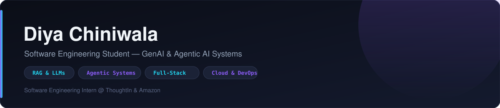
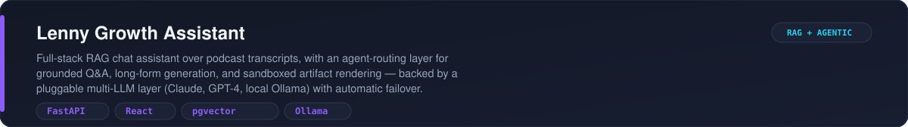
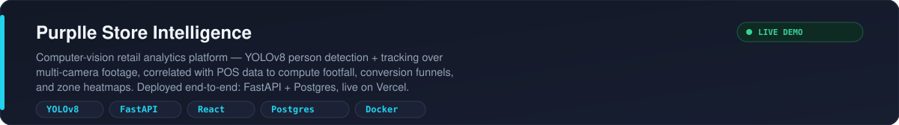
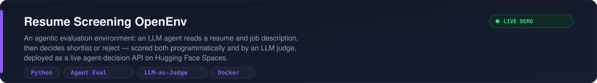
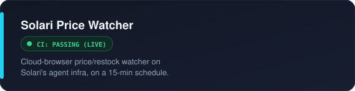
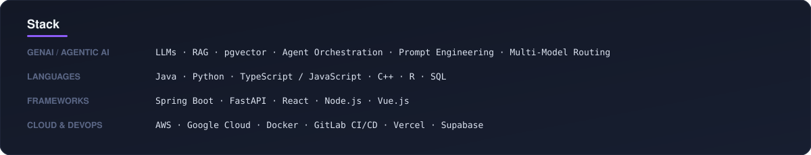

<!-- ══════════════════════════════════════════════ -->
<!-- DIYA CHINIWALA — github.com/diyaitis          -->
<!-- ══════════════════════════════════════════════ -->

 

  

&nbsp;&nbsp;

&nbsp;&nbsp;

<!-- ═══════════ PROJECTS ═══════════ -->

  

  

  

<table>
<tr>
<td></td>
<td></td>
</tr>
</table>

<!-- ═══════════ STACK ═══════════ -->

<!-- ═══════════ GITHUB ACTIVITY ═══════════ -->

  

<picture>
  <source media="(prefers-color-scheme: dark)" srcset="https://raw.githubusercontent.com/diyaitis/diyaitis/output/github-snake-dark.svg"/>
  <source media="(prefers-color-scheme: light)" srcset="https://raw.githubusercontent.com/diyaitis/diyaitis/output/github-snake.svg"/>
  
</picture>

<!-- ═══════════ CONNECT ═══════════ -->

<a href="https://linkedin.com/in/diya-chiniwala-b68a1a259"><code>LinkedIn</code></a> &#183;
<a href="mailto:diya.chiniwala@gmail.com"><code>Email</code></a> &#183;
<a href="https://github.com/diyaitis"><code>GitHub</code></a>

